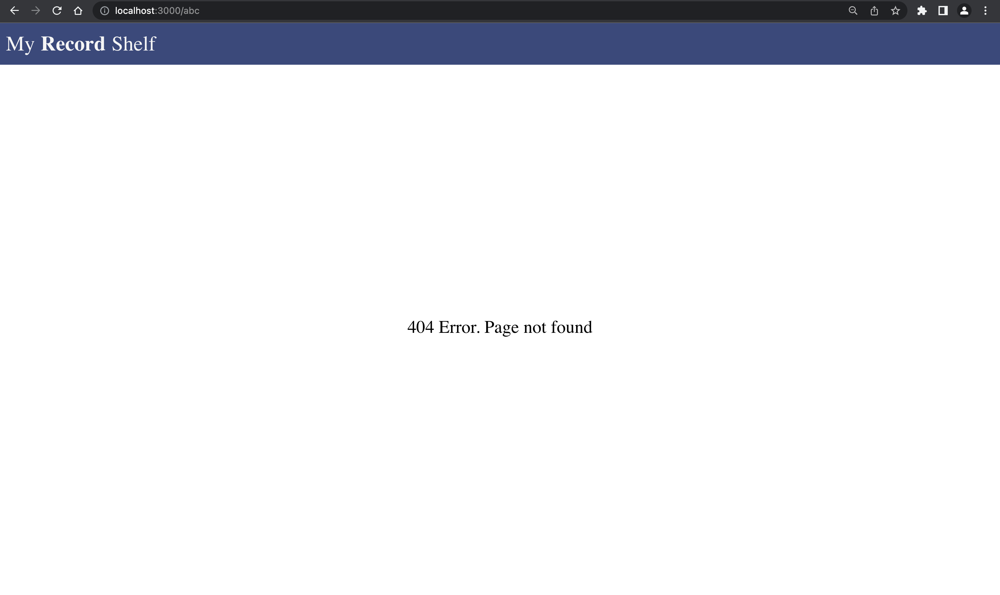

1. Clone the repo
2. `npm install` - Install all the packages
3. Create a authorizationToken.js file using the temp file and appropriate token
4. `npm run start` - Run the app
5. `npm run test` - Run the test cases
6. `npm run test:coverage` - Generate the code coverage test report

## My Record Shelf

### 1. Home page

### 2. Songs Page

### 3. Genres Page

### 3. Not Found Error Page

